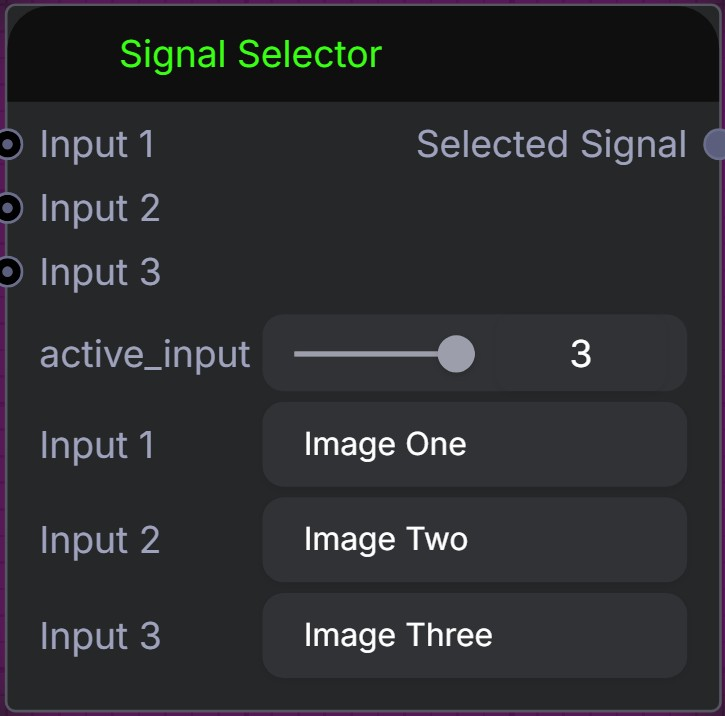

# Duffy Nodes

A custom node pack for [ComfyUI](https://github.com/comfyanonymous/ComfyUI) built on the modern **V3 Schema** (`comfy_api.latest`). Every node in this pack is stateless, strictly typed, and fully compatible with the Nodes 2.0 Vue-based frontend — no legacy JavaScript extensions required.

---

## Nodes

### Signal Selector

**Category:** `Duffy / Routing`

Routes one of three inputs to a single output using a mutually exclusive slider. Each channel carries a customizable text label so you can name your signals meaningfully inside the workflow. Thanks to **V3 lazy evaluation**, only the active channel's upstream graph is computed — the two idle branches are skipped entirely, saving processing time and VRAM.



#### Inputs

| Name | Type | Default | Description |
|------|------|---------|-------------|
| `active_input` | Int (slider 1 – 3) | `1` | Selects which input channel is routed to the output. |
| `Input 1` (`label_1`) | String | `Signal A` | Custom display label for channel 1. |
| `input_1` | Any (optional, lazy) | — | Data connected to channel 1. Evaluated only when `active_input = 1`. |
| `Input 2` (`label_2`) | String | `Signal B` | Custom display label for channel 2. |
| `input_2` | Any (optional, lazy) | — | Data connected to channel 2. Evaluated only when `active_input = 2`. |
| `Input 3` (`label_3`) | String | `Signal C` | Custom display label for channel 3. |
| `input_3` | Any (optional, lazy) | — | Data connected to channel 3. Evaluated only when `active_input = 3`. |

#### Output

| Name | Type | Description |
|------|------|-------------|
| `Selected Signal` | Any | The data from the currently active channel. |

#### How it works

1. Set `active_input` to `1`, `2`, or `3` using the slider on the node.
2. Give each channel a meaningful name via the **Input 1 / Input 2 / Input 3** text fields.
3. Connect your upstream nodes to the corresponding `input_1`, `input_2`, `input_3` ports.
4. Only the branch matching `active_input` is executed; the others are pruned from the evaluation graph by `check_lazy_status`.

#### Use cases

- Quickly A/B/C-test different model samplers, prompts, or image pre-processors without rewiring the graph.
- Build conditional workflow branches controlled by a single slider.
- Route any data type — images, latents, conditioning vectors, strings, custom objects — through the same switch.

### LoRa Prompt Combiner

**Category:** `Duffy / Text`

Combines a LoRa trigger and a main prompt using a customizable separator.

#### Inputs

| Name | Type | Default | Description |
|------|------|---------|-------------|
| `LoRa Trigger` (`lora_trigger`) | String (multiline) | `""` | The trigger words for the LoRa model. |
| `Separator` (`separator`) | String | `,` | The separator to use between the LoRa trigger and the main prompt. |
| `Prompt` (`prompt`) | String (multiline) | `""` | The main prompt text. |

#### Output

| Name | Type | Description |
|------|------|-------------|
| `Combined Prompt` | String | The combined prompt text. |

### Five Float Sliders

**Category:** `Duffy / Math`

Provides five float sliders (0.0 to 1.0) with customizable labels. The output descriptions and slider labels dynamically update to match the user-defined labels.

#### Inputs

| Name | Type | Default | Description |
|------|------|---------|-------------|
| `Label 1-5` (`label_1` to `label_5`) | String | `Value 1-5` | Custom labels for each slider. |
| `Value 1-5` (`value_1` to `value_5`) | Float (slider 0.0 – 1.0) | `0.5` | Float values for each slider. |

#### Output

| Name | Type | Description |
|------|------|-------------|
| `Value 1-5` (`out_1` to `out_5`) | Float | The float values from the sliders. |

### Five Int Sliders

**Category:** `Duffy / Math`

Provides five integer sliders (1 to 100) with customizable labels. The output descriptions and slider labels dynamically update to match the user-defined labels.

#### Inputs

| Name | Type | Default | Description |
|------|------|---------|-------------|
| `Label 1-5` (`label_1` to `label_5`) | String | `Value 1-5` | Custom labels for each slider. |
| `Value 1-5` (`value_1` to `value_5`) | Int (slider 1 – 100) | `50` | Integer values for each slider. |

#### Output

| Name | Type | Description |
|------|------|-------------|
| `Value 1-5` (`out_1` to `out_5`) | Int | The integer values from the sliders. |

### Integer Math

**Category:** `Duffy / Math`

Performs basic arithmetic on two integers. Choose from Add, Subtract, Multiply, or Divide via a dropdown. Division uses integer (floor) division; dividing by zero returns `0`.

#### Inputs

| Name | Type | Default | Description |
|------|------|---------|-------------|
| `A` (`a`) | Int | `0` | First operand. |
| `Operation` (`operation`) | Combo (`Add`, `Subtract`, `Multiply`, `Divide`) | `Add` | Arithmetic operation to perform. |
| `B` (`b`) | Int | `0` | Second operand. |

#### Output

| Name | Type | Description |
|------|------|-------------|
| `Result` (`result`) | Int | Result of the arithmetic operation. |

### Float Math

**Category:** `Duffy / Math`

Performs basic arithmetic on two floats. Choose from Add, Subtract, Multiply, or Divide via a dropdown. Dividing by zero returns `0.0`.

#### Inputs

| Name | Type | Default | Description |
|------|------|---------|-------------|
| `A` (`a`) | Float | `0.0` | First operand. |
| `Operation` (`operation`) | Combo (`Add`, `Subtract`, `Multiply`, `Divide`) | `Add` | Arithmetic operation to perform. |
| `B` (`b`) | Float | `0.0` | Second operand. |

#### Output

| Name | Type | Description |
|------|------|-------------|
| `Result` (`result`) | Float | Result of the arithmetic operation. |

### Toggle Switch

**Category:** `Duffy / Routing`

A 5-channel signal router with customizable labels and a single selector slider (1–5). Each channel accepts any data type. The slider determines which channel is routed to the output. Thanks to **V3 lazy evaluation**, only the active channel's upstream graph is computed — the four idle branches are skipped entirely.

#### Inputs

| Name | Type | Default | Description |
|------|------|---------|-------------|
| `Active Channel` (`active_input`) | Int (slider 1 – 5) | `1` | Selects which input channel is routed to the output. |
| `Label 1-5` (`label_1` to `label_5`) | String | `Input 1-5` | Custom display label for each channel. |
| `Input 1-5` (`input_1` to `input_5`) | Any (optional, lazy) | — | Data connected to each channel. Only the active channel is evaluated. |

#### Output

| Name | Type | Description |
|------|------|-------------|
| `Selected Signal` | Any | The data from the selected channel. |

### Multi-Pass Sampling

**Category:** `Duffy / Sampling`

Configures filename, filepath, denoise values, and step counts for multi-pass sampling workflows. All parameters are exposed as individual outputs so they can be wired directly into downstream sampler nodes.

#### Inputs

| Name | Type | Default | Description |
|------|------|---------|-------------|
| `Filename` (`filename`) | String | `Sampling_Output` | Output filename for the sampling result. |
| `Filepath` (`filepath`) | String | `./ComfyUI/output` | Output directory path. |
| `Denoise Value 1` (`denoise_1`) | Float (slider 0.0 – 1.0) | `1.00` | Denoise strength for pass 1. |
| `Denoise Value 2` (`denoise_2`) | Float (slider 0.0 – 1.0) | `0.75` | Denoise strength for pass 2. |
| `Denoise Value 3` (`denoise_3`) | Float (slider 0.0 – 1.0) | `0.50` | Denoise strength for pass 3. |
| `Steps Sampler 1` (`steps_1`) | Int (slider 1 – 100) | `20` | Sampling steps for pass 1. |
| `Steps Sampler 2` (`steps_2`) | Int (slider 1 – 100) | `20` | Sampling steps for pass 2. |
| `Steps Sampler 3` (`steps_3`) | Int (slider 1 – 100) | `20` | Sampling steps for pass 3. |

#### Outputs

| Name | Type | Description |
|------|------|-------------|
| `Filename` | String | The configured filename. |
| `Filepath` | String | The configured filepath. |
| `Denoise Value 1-3` | Float | Denoise strength for each pass. |
| `Steps Sampler 1-3` | Int | Step count for each pass. |

### RGBA to RGB (Lossless)

**Category:** `Duffy / Image`

Lossless conversion of RGBA image tensors to RGB by discarding the alpha channel via tensor slicing. Passes through RGB images unchanged and expands single-channel grayscale inputs to 3-channel RGB.

#### Inputs

| Name | Type | Description |
|------|------|-------------|
| `Image` (`image`) | Image | Input image tensor (RGBA, RGB, or grayscale). |

#### Output

| Name | Type | Description |
|------|------|-------------|
| `RGB Image` (`rgb_image`) | Image | The resulting 3-channel RGB image. |

### Load Image & Resize

**Category:** `Duffy / Image`

Combines image loading and megapixel resizing into a single node. Loads an image via the ComfyUI upload dialog, displays its metadata (filename, original dimensions, aspect ratio, megapixels), and resizes it to a target megapixel count. Optionally overrides the aspect ratio with a preset — non-original ratios center-crop the source image first. All output dimensions are snapped to multiples of 8 for VAE compatibility. The node also outputs the alpha channel as an inverted mask.

#### Inputs

| Name | Type | Default | Description |
|------|------|---------|-------------|
| `Image` (`image`) | Combo (image upload) | — | Select or upload an image from the input directory. |
| `Target Megapixels` (`target_megapixels`) | Float | `1.0` | Target size in megapixels (0.01–16.0). |
| `Aspect Ratio` (`aspect_ratio`) | Combo | `original` | Keep original or pick a preset (`1:1`, `4:3`, `3:2`, `16:9`, `21:9`, `3:4`, `2:3`, `9:16`, `9:21`). Non-original ratios center-crop the source first. |
| `Resample Method` (`method`) | Combo (`lanczos`, `bicubic`, `bilinear`, `nearest-exact`, `area`) | `lanczos` | Interpolation algorithm. |

#### Outputs

| Name | Type | Description |
|------|------|-------------|
| `Image` (`image`) | Image | The resized image. |
| `Mask` (`mask`) | Mask | Alpha-channel mask (inverted — black = opaque). |
| `Width` (`width`) | Int | Width of the resized image. |
| `Height` (`height`) | Int | Height of the resized image. |
| `Orig Width` (`original_width`) | Int | Original image width before resize. |
| `Orig Height` (`original_height`) | Int | Original image height before resize. |
| `Filename` (`filename`) | String | Source image filename. |
| `Megapixels` (`megapixels`) | Float | Megapixel count of the resized image. |
| `Aspect Ratio` (`aspect_ratio_str`) | String | Aspect ratio of the resized image (e.g. `16:9`). |

#### How it works

1. Select or upload an image using the built-in image picker.
2. Set the desired **Target Megapixels** — the image is scaled so its total pixel count matches this target.
3. Optionally choose an **Aspect Ratio** preset. When a non-original ratio is selected, the source image is center-cropped to that ratio before resizing.
4. After execution, the on-node info panel shows the filename, source dimensions, output dimensions, aspect ratio, and megapixel count.

#### Use cases

- Replace a separate Load Image → Resize chain with a single node.
- Quickly resize to a consistent megapixel budget while controlling aspect ratio for different model architectures.
- Feed the metadata outputs (width, height, filename, megapixels) into downstream nodes for conditional logic or file naming.

### Megapixel Resize

**Category:** `Duffy / Image`

Resizes images to a target megapixel count while preserving aspect ratio. Output dimensions are rounded to the nearest multiple of 8 for VAE compatibility.

#### Inputs

| Name | Type | Default | Description |
|------|------|---------|-------------|
| `Image` (`image`) | Image | — | The input image batch. |
| `Target Megapixels` (`target_megapixels`) | Float | `1.0` | Target size in megapixels (e.g. 1.0 ≈ 1024×1024). |
| `Resample Method` (`method`) | Combo (`lanczos`, `bicubic`, `bilinear`, `nearest-exact`, `area`) | `lanczos` | Interpolation algorithm. |

#### Outputs

| Name | Type | Description |
|------|------|-------------|
| `Image` (`image`) | Image | The resized image. |
| `Width` (`width`) | Int | Width of the resized image in pixels. |
| `Height` (`height`) | Int | Height of the resized image in pixels. |

### Save Image with Sidecar TXT

**Category:** `Duffy / IO`

Saves images in PNG, JPG, or WEBP format and writes a companion `.txt` file alongside each image containing model details, prompts, and multi-pass sampling metadata.

#### Inputs

| Name | Type | Default | Description |
|------|------|---------|-------------|
| `Images` (`images`) | Image | — | Image batch to save. |
| `Filename Prefix` (`filename_prefix`) | String | `ComfyUI` | Base name for saved files. |
| `File Format` (`file_format`) | Combo (`PNG`, `JPG`, `JPEG`, `WEBP`) | `PNG` | Output image format. |
| `Output Path` (`output_path`) | String (optional) | `""` | Custom output directory. |
| `Positive Prompt` (`positive_prompt`) | String (optional, multiline) | `""` | Positive prompt text. |
| `Negative Prompt` (`negative_prompt`) | String (optional, multiline) | `""` | Negative prompt text. |
| `Model Name` (`model_name`) | String (optional) | `Unknown Model` | Diffusion model name. |
| `CLIP Name` (`clip_name`) | String (optional) | `Unknown CLIP` | CLIP model name. |
| `VAE Name` (`vae_name`) | String (optional) | `Unknown VAE` | VAE model name. |
| Pass 1–3 Sampler/Scheduler/Steps/Seed | String / Int (optional) | — | Per-pass sampling metadata. |

#### Output

This is an **output node** — it saves files to disk and displays a thumbnail preview. No output ports.

### Directory Image Iterator

**Category:** `Duffy / Image`

Loads a sorted slice of images from a directory and emits them as a list for downstream iteration. Supports mixed resolutions, start index / limit controls, and smart cache invalidation that re-executes only when the actual file slice changes.

#### Inputs

| Name | Type | Default | Description |
|------|------|---------|-------------|
| `Folder Path` (`folder_path`) | String | `""` | Absolute path to the image directory. |
| `Start Index` (`start_index`) | Int | `0` | Zero-based index of the first image. |
| `Image Limit` (`image_limit`) | Int | `0` | Max images to load (0 = all). |

#### Outputs

| Name | Type | Description |
|------|------|-------------|
| `Image` (`image`) | Image (list) | One image tensor per file. |
| `Filename` (`filename`) | String (list) | Original filename of each image. |

### Iterator Current Filename

**Category:** `Duffy / Image`

Helper node for Directory Image Iterator. Strips file extensions from a list of filenames, producing clean filename prefixes suitable for wiring into SaveImage.

#### Inputs

| Name | Type | Description |
|------|------|-------------|
| `Filename` (`filename`) | String (list) | Filename list from Directory Image Iterator. |

#### Output

| Name | Type | Description |
|------|------|-------------|
| `Filename Prefix` (`filename_prefix`) | String (list) | Filename with extension stripped. |

### Empty Qwen-2512 Latent Image

**Category:** `Duffy / Latent`

Creates an empty 16-channel latent tensor for the Qwen-Image-2512 model. Select a base resolution from a dropdown of optimised aspect ratios and optionally scale it with a multiplier. Dimensions are automatically snapped to multiples of 16 for clean patch alignment.

#### Inputs

| Name | Type | Default | Description |
|------|------|---------|-------------|
| `Resolution` (`resolution`) | Combo | `16:9 (1664x928)` | Base resolution preset for the Qwen-Image-2512 architecture. |
| `Size Multiplier` (`size_multiplier`) | Float (slider 1.0 – 2.0) | `1.0` | Scales the base resolution. |
| `Batch Size` (`batch_size`) | Int | `1` | Number of latent images in the batch. |

#### Outputs

| Name | Type | Description |
|------|------|-------------|
| `Latent` (`latent`) | Latent | Empty 16-channel latent tensor. |
| `Width` (`width`) | Int | Pixel width after scaling and alignment. |
| `Height` (`height`) | Int | Pixel height after scaling and alignment. |

### Latent Noise Blender

**Category:** `Duffy / Latent`

Blends a base latent with a noise latent using a percentage slider. Automatically resizes noise to match the image dimensions and handles device mismatches.

#### Inputs

| Name | Type | Default | Description |
|------|------|---------|-------------|
| `Latent Image` (`latent_image`) | Latent | — | The base latent structure. |
| `Latent Noise` (`latent_noise`) | Latent | — | The noise latent to blend in. |
| `Blend %` (`blend_percentage`) | Int (slider 0 – 100) | `50` | 0 = pure image, 100 = pure noise. |

#### Output

| Name | Type | Description |
|------|------|-------------|
| `Blended Latent` (`blended_latent`) | Latent | Result of blending the image and noise latents. |

### Generate Noise (Flux 2 Klein)

**Category:** `Duffy / Latent`

Generates highly parameterised noise for injection or use as empty latents. Supports Flux 2 Klein architectures (128 channels, f16 spatial downsampling) alongside SD1.5/SDXL/SD3 workflows (4/16 channels, f8). Offers seed control, variance normalisation, sigma-based scaling, and three tensor layouts for image or video synthesis.

#### Inputs

| Name | Type | Default | Description |
|------|------|---------|-------------|
| `Width` (`width`) | Int | `1024` | Pixel width (step of 16 for f16 alignment). |
| `Height` (`height`) | Int | `1024` | Pixel height (step of 16 for f16 alignment). |
| `Batch Size` (`batch_size`) | Int | `1` | Number of noise samples to generate. |
| `Seed` (`seed`) | Int | `123` | Random seed for deterministic generation. |
| `Multiplier` (`multiplier`) | Float | `1.0` | Intensity multiplier applied to the noise. |
| `Constant Batch Noise` (`constant_batch_noise`) | Boolean | `False` | All batch items share identical noise. |
| `Normalize` (`normalize`) | Boolean | `False` | Normalize noise to unit variance. |
| `Model` (`model`) | Model (optional) | — | Model used for sigma-based variance scaling. |
| `Sigmas` (`sigmas`) | Sigmas (optional) | — | Sigma schedule for variance scaling. |
| `Latent Channels` (`latent_channels`) | Combo (`4`, `16`, `128`) | `4` | Channel count: 4 = SD1.5/SDXL, 16 = SD3, 128 = Flux 2. |
| `Shape` (`shape`) | Combo (`BCHW`, `BCTHW`, `BTCHW`) | `BCHW` | Tensor layout: BCHW for images, BCTHW/BTCHW for video. |

#### Output

| Name | Type | Description |
|------|------|-------------|
| `Latent` (`latent`) | Latent | Generated noise tensor wrapped in a latent dictionary. |

---

## Installation

### Via ComfyUI Manager *(recommended)*

Search for **Duffy Nodes** inside ComfyUI Manager and click **Install**.

### Manual

```bash
cd ComfyUI/custom_nodes
git clone https://github.com/duffy/comfyui-duffy-nodes
cd comfyui-duffy-nodes
pip install -r requirements.txt
```

Restart ComfyUI. The nodes will appear under the **Duffy** category in the node browser.

---

## Requirements

| Dependency | Minimum version |
|------------|-----------------|
| Python | 3.10 |
| PyTorch | 2.1.0 |
| NumPy | 1.26.0 |
| ComfyUI | Nodes 2.0 (V3 Schema) |

---

## Architecture

All nodes are built on the **ComfyUI V3 Schema** (`comfy_api.latest.io`):

- **Stateless execution** — every run is a pure function of its inputs; no hidden state between queue passes.
- **Declarative schema** — inputs, outputs, and UI widgets are defined once in `define_schema()`. The Vue frontend auto-generates the UI from that definition with no JavaScript needed.
- **Lazy evaluation** — `check_lazy_status` tells the ComfyUI scheduler which upstream branches to skip, preventing wasted computation on inactive paths.
- **Async registration** — the extension is loaded through `comfy_entrypoint` / `ComfyExtension.get_node_list()`, isolating startup errors and enabling safe concurrent extension loading.

---

## License

MIT — see [LICENSE](LICENSE) for details.
