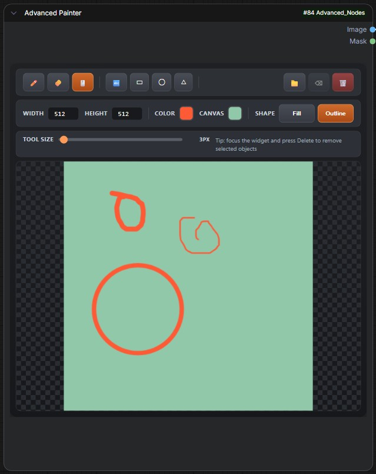

# 🎨 Duffy Nodes - ComfyUI Custom Node Pack

[](https://opensource.org/licenses/MIT)
[](https://github.com/comfyanonymous/ComfyUI)
[](https://github.com/comfyanonymous/ComfyUI)
[](https://www.python.org/)

A comprehensive collection of custom nodes for ComfyUI, built with the modern **Nodes 2.0 V3 Schema** architecture. This pack provides essential utilities, advanced image processing, flexible primitives, and powerful workflow helpers designed for professional AI art generation pipelines.

[!TIP]
**Modern UI Integration:** Several nodes in this pack feature advanced **Vue 3** interactive interfaces for a superior user experience. These frontend components are **precompiled** into the `web/js` directory. Users do not need to install Node.js, Vite, or any build tools to use this pack; it works immediately upon installation like any other ComfyUI extension.

---

## ✨ Features

🚀 **Modern Architecture** - Built with ComfyUI Nodes 2.0 and Schema V3 for maximum performance and compatibility  
🎯 **35+ Professional Nodes** - Carefully crafted tools covering primitives, math, image processing, sampling, and more  
⚡ **GPU Accelerated** - Leverages PyTorch and torchvision for blazing-fast image operations  
🔧 **Stateless Design** - Clean, predictable behavior with proper caching and fingerprinting  
🎨 **Custom UI Widgets** - Enhanced user experience with specialized Vue-compatible interfaces  
📦 **Zero Dependencies** - Works out of the box with your existing ComfyUI installation  

---

## 📦 Installation

### Method 1: ComfyUI Manager (Recommended)
1. Open ComfyUI Manager
2. Search for "Duffy Nodes"
3. Click Install

### Method 2: Manual Installation
```bash
cd ComfyUI/custom_nodes
git clone https://github.com/yourusername/comfyui-duffy-nodes.git
cd comfyui-duffy-nodes
pip install -r requirements.txt
```

Restart ComfyUI after installation.

---

## 📚 Node Catalog

### 🔢 Primitive Nodes
Essential input nodes for basic data types with clean, intuitive interfaces.

#### ➕ Primitive Integer

*Category: `Duffy/Primitives`*

Simple integer input with configurable range (-9007199254740991 to 9007199254740991). Perfect for counters, indices, and discrete parameters.

**Outputs:** `INTEGER`

---

#### ➕ Primitive Float  

*Category: `Duffy/Primitives`*

Floating-point input with high precision support. Ideal for weights, multipliers, and continuous parameters.

**Outputs:** `FLOAT`

---

#### 📝 Primitive String

*Category: `Duffy/Primitives`*

Single-line text input for prompts, filenames, and short text snippets.

**Outputs:** `STRING`

---

#### 📄 Primitive String (Multiline)

*Category: `Duffy/Primitives`*

Multi-line text editor for complex prompts, descriptions, and formatted text.

**Outputs:** `STRING`

---

#### 🔘 Primitive Boolean

*Category: `Duffy/Logic`*

Simple boolean toggle input (True/False). Perfect for enabling/disabling workflow branches and controlling logic gates.

**Outputs:** `BOOLEAN`

---

### 🧮 Math Operations
Powerful mathematical nodes for precise numerical control.

#### ➗ Float Math

*Category: `Duffy/Math`*

Perform arithmetic operations on floating-point values. Supports addition, subtraction, multiplication, division, power, and modulo.

**Inputs:** `a` (float), `b` (float), `operation` (dropdown)  
**Outputs:** `result` (float)

**Operations:** Add, Subtract, Multiply, Divide, Power, Modulo

---

#### ✖️ Integer Math

*Category: `Duffy/Math`*

Integer-based mathematical operations with floor division support. Perfect for discrete calculations and index manipulation.

**Inputs:** `a` (int), `b` (int), `operation` (dropdown)  
**Outputs:** `result` (int)

**Operations:** Add, Subtract, Multiply, Floor Divide, Power, Modulo

---

### 🧠 Logic Operations
Perform boolean logic and conditional routing.

#### 🧩 Logic Gate

*Category: `Duffy/Logic`*

Perform boolean logical operations on inputs. Supports standard gates including AND, OR, NOT, NAND, NOR, XOR, and XNOR.

**Inputs:** `a` (boolean), `b` (boolean, optional), `operation` (dropdown)  
**Outputs:** `result` (boolean)

**Operations:** AND, OR, NOT, NAND, NOR, XOR, XNOR

---

#### 🎛️ Five Float Sliders

*Category: `Duffy/Math`*

Five independent float sliders (0.0–100.0) with custom UI widget. Ideal for multi-parameter experimentation and fine-tuning.

**Outputs:** `float_1`, `float_2`, `float_3`, `float_4`, `float_5`

---

#### 🎚️ Five Int Sliders

*Category: `Duffy/Math`*

Five independent integer sliders (0–100) with synchronized UI. Perfect for batch processing controls and discrete parameter sweeps.

**Outputs:** `int_1`, `int_2`, `int_3`, `int_4`, `int_5`

---

### 🖼️ Image Processing
Advanced image manipulation nodes with GPU acceleration.

#### 🎨 Image Adjuster

*Category: `Duffy/Image`*

Professional-grade color correction tool. Adjust brightness, contrast, saturation, and hue with GPU-accelerated torchvision transforms.

**Inputs:** `image` (IMAGE), `brightness` (0.0–3.0), `contrast` (0.0–3.0), `saturation` (0.0–3.0), `hue` (-0.5–0.5)  
**Outputs:** `IMAGE`

**Features:**
- Real-time GPU acceleration via torchvision
- Zero-cost pass-through for unmodified parameters
- Automatic tensor permutation handling
- Output clamping prevents artifacts

---

#### 🎨 Advanced Image Adjuster

*Category: `Duffy/Image`*

Interactive post-processing node that pauses your workflow to allow real-time image adjustment. Dial in the perfect look with a live preview before continuing the execution.

**Inputs:** `image` (IMAGE), `pause_execution` (boolean), `saved_adjustments` (hidden JSON state)  
**Outputs:** `image` (IMAGE)

**Features:**
- ⏸️ **Workflow Pausing** — Execution stops at the node, revealing an interactive adjustment studio.
- 📺 **Live Preview** — See your changes instantly with a responsive CSS-filtered preview that mirrors the backend math.
- 🎛️ **Precise Sliders** — Fine-tune brightness (0.0–3.0), contrast (0.0–3.0), saturation (0.0–3.0), and hue (-0.5–0.5).
- ⚡ **Pure PyTorch Backend** — Final adjustments are computed using optimized tensor operations, ensuring high-quality output without external dependencies.
- 💾 **State Persistence** — Your settings are saved into the workflow metadata for easy reproduction or batch runs.
- 🔄 **Double-Click Reset** — Quickly reset individual sliders to their default values with a double-click.

**Use Cases:** Visual fine-tuning of generations, color grading, mood adjustment, and interactive A/B testing of image parameters.

---

#### 📐 Megapixel Resize

*Category: `Duffy/Image`*

Intelligent image resizer targeting specific megapixel counts while preserving aspect ratio. Perfect for consistent resolution workflows.

**Inputs:** `image` (IMAGE), `target_megapixels` (float), `mode` (dropdown)  
**Outputs:** `IMAGE`, `width` (int), `height` (int)

**Modes:** Bilinear, Nearest, Bicubic, Area, Lanczos

---

#### 📂 Load Image & Resize

*Category: `Duffy/Image`*

Combined image loader and intelligent resizer. Loads images and automatically resizes to target megapixels in one step.

**Inputs:** `image` (file picker), `target_megapixels` (float), `mode` (dropdown)  
**Outputs:** `IMAGE`, `width` (int), `height` (int), `MASK`

---

#### 🎭 RGBA to RGB Converter

*Category: `Duffy/Image`*

Convert RGBA images to RGB with configurable background color. Handles alpha blending gracefully.

**Inputs:** `image` (IMAGE), `background_color` (dropdown)  
**Outputs:** `IMAGE`

**Background Options:** White, Black, Custom RGB

---

#### 💾 Save Image with Sidecar

*Category: `Duffy/Image`*

Save images with JSON metadata sidecar files. Perfect for tracking generation parameters and workflow documentation.

**Inputs:** `images` (IMAGE), `filename_prefix` (string), `metadata` (dict)  
**Outputs:** Saved files + JSON metadata

---

#### 📁 Directory Image Iterator

*Category: `Duffy/Image`*

Iterate through images in a directory with automatic batching. Essential for batch processing workflows.

**Inputs:** `directory` (string), `index` (int), `recursive` (boolean)  
**Outputs:** `IMAGE`, `filename` (string), `total_count` (int)

---

#### 🏷️ Iterator Current Filename

*Category: `Duffy/Image`*

Extract and pass through the current filename from directory iterator. Useful for metadata and naming.

**Inputs:** `filename` (string)
**Outputs:** `STRING`

---

#### 🖼️ Image Preview

*Category: `Duffy/Image`*

Simple image preview node that displays an image batch natively within the node. Serving strictly as a visual endpoint, it helps you inspect images at any point in your workflow.

**Inputs:** `image` (IMAGE)
**Outputs:** (Visual only)

**Features:**
- ⚡ **Native Rendering** — Leverages ComfyUI's standard image preview widget for reliable and consistent display.
- 📦 **Stateless V3 Execution** — Clean, predictable behavior with proper caching and fingerprinting.
- 🚀 **Batch Support** — Automatically handles and displays all images in a batch.
- 🛡️ **Zero Overhead** — Minimal performance impact, designed for visual verification.

**Use Cases:** Visual inspection of intermediate results, prompt testing, and final output verification.

---

#### 🔍 Image Compare
*Category: `Duffy/Image`*

Interactively compare two images with a vertical, laser-sharp slider that adjusts to your mouse position. Perfect for identifying subtle differences between two connected images (e.g., comparing different upscalers or sampling parameters).

**Inputs:** `image_a` (IMAGE), `image_b` (IMAGE)
**Outputs:** (Visual only)

**Features:**
- ⚡ **Interactive Scrubbing** — Move your mouse horizontally over the node to reveal `image_a` over `image_b` in real-time.
- 🌈 **Laser-Sharp Divider** — High-visibility cyan divider line with a glow effect for precise boundary identification.
- 📐 **Responsive Scaling** — Automatically fits images of any size using `object-fit: contain` while preserving aspect ratios.
- 🛡️ **Pointer Isolation** — Interaction logic is isolated from the ComfyUI canvas, allowing smooth scrubbing without accidentally dragging the node.
- 🚀 **Stateless V3 Execution** — Efficiently processes image batches and updates the UI via the modern `onExecuted` lifecycle hook.

**Use Cases:** A/B testing, upscaler comparison, noise-level analysis, color grading verification, and spot-the-difference debugging.

---

#### 🎨 Advanced Painter

*Category: `Duffy/Image`*

A professional-grade interactive painting studio powered by Vue 3 and Fabric.js. Create, edit, and manipulate layers directly within ComfyUI with a full suite of drawing tools, vector shapes, and image transformation capabilities.

**Inputs:** `json_data` (hidden JSON state)  
**Outputs:** `image` (IMAGE), `mask` (MASK)

**Features:**
- 🖌️ **Painting Toolkit** — Pencil and Eraser brushes with adjustable size and real-time feedback.
- 📐 **Vector Shapes** — Add Rectangles, Circles, and Triangles with customizable Fill or Outline styles.
- 🔤 **Text Support** — Insert and style text layers with adjustable font properties.
- 🖼️ **Image Integration** — Upload background images directly to the canvas for over-painting or reference.
- 📑 **Object Management** — Select, move, and delete individual canvas elements with ease.
- 🎭 **Dual Output** — Generates both a high-quality RGB image and a precise transparency-based Mask.
- 💾 **State Persistence** — Your entire canvas composition is saved into the workflow metadata.
- ⚡ **Fabric.js Engine** — High-performance canvas interactions with smooth vector scaling and rotation.

**Use Cases:** Manual inpainting preparation, custom mask creation, layout sketching, composition planning, and interactive image markup.

---

#### 🔍 Advanced Folder Image Selector

*Category: `Duffy/Image/Selection`*

Interactive thumbnail browser for selecting up to 10 images from a directory. Features pagination, sorting, and real-time preview.

**Inputs:** `folder_path` (string), `selected_images_state` (string, hidden)  
**Outputs:** `image_1`, `image_2`, `image_3`, `image_4`, `image_5`, `image_6`, `image_7`, `image_8`, `image_9`, `image_10` (IMAGE)

**Features:**
- 🖼️ Thumbnail grid with 3×3 pagination
- 🔄 Sort by filename or creation date
- ✅ Visual selection indicators with badges
- 💾 Persistent selection state across sessions
- ⚡ Async thumbnail generation for performance

**Use Cases:** Manual image selection from large batches, creating comparison workflows, curating datasets

---

#### 🧩 Image Stitch

*Category: `Duffy/Image`*

Upload up to 9 images via an interactive 3×3 grid and stitch them into a single output image — horizontally, vertically, or in a grid layout. Drag-and-drop reordering lets you control the exact image sequence before stitching.

**Inputs:** `orientation` (Horizontal/Vertical/Layout), `image_1`–`image_9` (file upload, optional)  
**Outputs:** `stitched_image` (IMAGE)

**Features:**
- 🖼️ Interactive 3×3 grid with numbered slot badges (always visible)
- 📤 Per-slot image upload via ComfyUI's native upload mechanism
- 🔀 Drag-and-drop reordering between grid cells
- ↔️ Horizontal mode: scales all images to the tallest height, preserving aspect ratios
- ↕️ Vertical mode: center-crops all images to the narrowest width
- ⊞ Layout mode: stitches images preserving their 3×3 grid positions — empty rows/columns are excluded, empty cells within active rows/columns are filled with black
- ❌ Per-slot clear button to remove individual images
- 🎨 Custom orientation toggle (→ Horizontal / ↓ Vertical / ⊞ Layout)

**Use Cases:** Contact sheets, image comparisons, before/after compositions, multi-image collages, reference boards

---

#### 🔗 Connected Image Stitch

*Category: `Duffy/Image`*

A connection-based variant of Image Stitch. Instead of uploading images directly, connect up to 9 image outputs from other nodes and stitch them into a single output image. In Layout mode, an interactive 3×3 mapping grid lets you assign any input to any grid position.

**Inputs:** `orientation` (Horizontal/Vertical/Layout), `image_1`–`image_9` (IMAGE, optional connections), `layout_pos_1`–`layout_pos_9` (hidden, used by Layout grid)
**Outputs:** `stitched_image` (IMAGE)

**Features:**
- 🔌 9 optional image input connections — wire outputs from Load Image, VAE Decode, or any image-producing node
- ↔️ Horizontal mode: scales all connected images to the tallest height, preserving aspect ratios
- ↕️ Vertical mode: center-crops all connected images to the narrowest width
- ⊞ Layout mode: interactive 3×3 mapping grid with per-cell dropdown to assign any input (Image 1–9) to any grid position
- 🔄 "Reset to Default (1–9)" button to restore identity mapping
- 🛡️ Graceful handling of unconnected inputs — if a grid cell references an input that isn't connected, it is treated as empty (black)
- 🎨 Same orientation toggle and Duffy node theming as Image Stitch

**Use Cases:** Dynamic image compositions from upstream nodes, workflow-driven collages, pipeline-based contact sheets, comparing outputs from multiple generation branches

---

#### 🔗 Advanced Connected Image Stitch

*Category: `Duffy/Image`*

An interactive version of the Connected Image Stitch node. It pauses execution to provide a real-time 3×3 grid workspace where you can visually map up to 9 connected image inputs to specific grid cells with a live preview of the final stitched result.

**Inputs:** `image_1`–`image_9` (IMAGE, optional connections), `saved_layout` (hidden JSON state), `pause_execution` (boolean)
**Outputs:** `stitched_image` (IMAGE)

**Features:**
- ⏸️ **Workflow Pausing** — Execution stops at the node, revealing an interactive stitching studio.
- 🖼️ **Live 3×3 Preview** — See exactly how your images will be combined before continuing the workflow.
- ↔️ **Multiple Modes** — Supports Horizontal, Vertical, and custom 3×3 Grid Layouts.
- 📍 **Visual Mapping** — Drag-and-drop or use dropdowns to assign any connected input (1-9) to any grid position.
- ⚡ **Optimized Backend** — Reuses high-quality Lanczos scaling and center-cropping logic for consistent results.
- 💾 **State Persistence** — Your layout configurations are saved into the workflow metadata.

**Use Cases:** Visual contact sheet composition, custom multi-image collages, interactive A/B comparison grids, and complex layout prototyping.

---

#### 🔠 Image Text Overlay

*Category: `Duffy/Image`*

Stateless V3 node to overlay text onto an image batch. Features a modern color picker, font size slider, precise X/Y positioning, and a robust font resolution engine that supports custom `.ttf`/`.otf` files and system-wide fonts.

**Inputs:** `image` (IMAGE), `text` (string, multiline), `font_color` (hex string), `font_size` (int, 8–1024), `font_name` (dropdown), `position_x` (int), `position_y` (int)
**Outputs:** `image` (IMAGE)

**Features:**
- 🎨 **Modern Color Picker** — Injected HTML5 color widget for intuitive font color selection
- 🔤 **Custom Font Support** — Drop your own `.ttf`, `.otf`, or `.ttc` files into the `fonts/` directory for automatic detection
- 🏢 **System Font Mapping** — Robust resolution for standard Windows and macOS system fonts (Arial, Impact, etc.)
- 📐 **Precise Placement** — Interactive sliders for pixel-perfect X/Y text positioning
- ⚡ **GPU-Friendly** — Processes batch image tensors in standard `[B, H, W, C]` layout

**Use Cases:** Adding watermarks, labeling generation parameters, creating memes, cinematic titles, and procedural text overlays.

---

#### 🧾 Advanced Text Overlay

*Category: `Duffy/Image`*

Interactive multi-layer text compositor that pauses execution so you can place, style, and preview multiple text overlays directly on the image before continuing the workflow.

**Inputs:** `image` (IMAGE), `saved_overlays` (hidden JSON state), `pause_execution` (boolean)  
**Outputs:** `image` (IMAGE)

**Features:**
- ⏸️ **Interactive Pause Workflow** — Stops execution and opens a dedicated text overlay studio for live editing.
- 🧱 **Multiple Text Layers** — Add, remove, and manage multiple independent text blocks in a single node.
- 🔤 **Font Browser Support** — Uses system fonts and automatically detects custom `.ttf`, `.otf`, and `.ttc` files from the `fonts/` directory.
- 🎨 **Live Styling Controls** — Adjust text, font, size, color, and normalized X/Y placement with immediate preview feedback.
- 💾 **Persistent Overlay State** — Stores layer configuration in hidden workflow state so layouts can be reused and resumed.

**Use Cases:** Poster layouts, captions, subtitles, meme composition, watermark stacks, title cards, and multi-label annotation workflows.

---

#### 💡 Interactive Relighting

*Category: `Duffy/Image`*

Pause your workflow and interactively relight your images in real-time. Add multiple 2D light sources—**Point**, **Directional**, and **Ambient**—and manipulate them directly on a high-fidelity canvas preview before continuing the execution.

**Inputs:** `image` (IMAGE), `pause_execution` (boolean), `saved_lights` (hidden JSON state)  
**Outputs:** `image` (IMAGE)

**Features:**
- ⏸️ **Workflow Pausing** — Execution stops at the node, revealing an interactive lighting studio.
- 🔦 **Multiple Light Types** — Mix and match Point lights (radial falloff), Directional lights (linear gradients), and Ambient fills.
- 🎨 **Real-time Color & Intensity** — Adjust RGB colors and light power with immediate visual feedback on the canvas.
- 📍 **Precision Positioning** — Drag-and-drop simulated light centers and adjust radii or angles with fine-tuned sliders.
- ⚡ **PyTorch Backend** — The final lighting is computed using high-performance PyTorch tensor math, ensuring the output perfectly matches your preview.
- 💾 **State Persistence** — Your lighting configurations are saved into the workflow metadata, allowing for easy reproduction or batch processing.

**Use Cases:** Dramatic portrait relighting, mood adjustment, highlighting specific subjects, simulated studio photography, and creative color grading.

---

### 🎲 Latent Operations
Specialized nodes for latent space manipulation and noise generation.

#### 📦 Empty Qwen 2512 Latent

*Category: `Duffy/Latent`*

Generate empty latent tensors optimized for Qwen 2.5 12B model workflows. Ensures proper dimensionality and scaling.

**Inputs:** `width` (int), `height` (int), `batch_size` (int)  
**Outputs:** `LATENT`

---

#### 🌊 Flux Klein Noise Generator

*Category: `Duffy/Latent`*

Advanced noise generator implementing Klein mathematical patterns for Flux model initialization.

**Inputs:** `latent` (LATENT), `seed` (int), `strength` (float)  
**Outputs:** `LATENT`

---

#### 🎭 Latent Noise Blender

*Category: `Duffy/Latent`*

Blend two latent tensors with configurable mixing ratio. Enables latent interpolation and noise injection workflows.

**Inputs:** `latent_a` (LATENT), `latent_b` (LATENT), `blend_factor` (0.0–1.0)  
**Outputs:** `LATENT`

---

### 🎯 Sampling & Scheduling
Advanced sampling control nodes for fine-grained generation control.

#### 🔀 Triple Sampler & Scheduler Selector

*Category: `Duffy/Sampling`*

Select three independent sampler + scheduler combinations simultaneously. Perfect for comparative analysis and permutation testing.

**Outputs:** `Sampler 1`, `Scheduler 1`, `Sampler 2`, `Scheduler 2`, `Sampler 3`, `Scheduler 3` (all strings)

**Features:**
- Dynamic population from ComfyUI's sampler registry
- Automatic detection of custom samplers/schedulers
- Optimized for parallelized grid testing
- Civitai metadata compatible

---

#### 🎪 Multi-Pass Sampling

*Category: `Duffy/Sampling`*

Execute multiple sampling passes with different parameters in sequence. Enables iterative refinement workflows.

**Inputs:** `latent` (LATENT), `passes` (int), `steps_per_pass` (int)  
**Outputs:** `LATENT`

---

### 🔧 Selectors & Utilities
Workflow helpers for routing and dynamic selection.

#### 📡 Signal Selector

*Category: `Duffy/Selectors`*

Route one of five inputs to a single output based on selector index. Universal type support via `*` wildcard.

**Inputs:** `selector` (1–5), `input_1` through `input_5` (any type)  
**Outputs:** Selected input (preserves type)

---

#### 🔀 Toggle Switch

*Category: `Duffy/Selectors`*

Binary switch between two inputs with custom UI. Clean A/B testing interface.

**Inputs:** `enable` (boolean), `input_a` (any), `input_b` (any)  
**Outputs:** Selected input (preserves type)

---

#### 📂 Model Selector

*Category: `Duffy/Selectors`*

Dynamic model selection interface for Diffusion, CLIP, and VAE models. Scans custom directories and populates dropdowns automatically.

**Inputs:** `models_path` (string)  
**Outputs:** `diffusion_model` (string), `clip_model` (string), `vae_model` (string)

**Features:**
- User-provided base path
- Recursive folder scanning
- Multiple model format support (.safetensors, .ckpt, .pt, .bin, .pth, .gguf)
- Path traversal protection
- Dynamic dropdown population via REST API

---

#### � Seed

*Category: `Duffy/utilities`*

Advanced seed node with randomize, increment, decrement, and fixed modes. Handles seed generation on the frontend before the prompt is sent to the server, ensuring reproducibility and proper metadata embedding. Includes a server-side fallback for direct API usage.

**Inputs:** `seed` (INT, range ±1,125,899,906,842,624)  
**Outputs:** `SEED` (INT)

**Features:**
- 🎲 **Randomize Each Time** — generates a new random seed on every queue (seed = -1)
- 🔒 **New Fixed Random** — generates a single random seed and locks it in place
- ♻️ **Use Last Queued Seed** — restores the last actually-used seed value
- ➕ **Increment / Decrement** — automatically increments or decrements the last seed (seed = -2 / -3)
- 📡 **Frontend prompt interception** — replaces special seed values in the serialized prompt and workflow metadata before they reach the server, avoiding caching issues
- 🛡️ **Server-side API fallback** — when special seeds arrive via direct API calls (no frontend), the backend generates a random seed and persists it to workflow & prompt metadata
- 📋 **Context menu** with quick actions and toggleable "Last Seed" display widget
- 🧩 Removes the default ComfyUI `control_after_generate` dropdown in favor of dedicated buttons

**Use Cases:** Reproducible generation runs, iterative seed exploration, A/B seed comparison, API-driven batch pipelines

---
#### 📝 JSON Format String

*Category: `Duffy/utilities`*

Parses a raw JSON string and outputs it as a well-formatted multiline representation. Connect a Primitive String (Multiline) containing JSON to the input, then pipe the output to another String Multiline or Show Any node for clean display.

**Inputs:** `json_text` (string, multiline), `format_mode` (dropdown), `indent_size` (int, 1–8)  
**Outputs:** `formatted_text` (STRING)

**Format Modes:**
- **Pretty JSON** — Standard indented JSON with proper line breaks
- **Readable Text** — Human-friendly labeled sections with nested indentation (e.g. `Scene: ...`, `Color Palette:`, `  Tile Teal: #20B2AA`)

---
#### 🔎 Find and Replace Text

*Category: `Duffy/Text`*

Perform literal find-and-replace operations on single-line or multiline strings. Useful for prompt cleanup, token renaming, metadata normalization, and bulk text edits inside a workflow.

**Inputs:** `text` (string, multiline), `find_text` (string), `replace_with` (string), `case_sensitive` (boolean)  
**Outputs:** `text` (STRING)

**Behavior:**
- Replaces all matches across the full input string
- Supports case-sensitive and case-insensitive matching
- Returns the original input unchanged when `find_text` is empty

---
#### �🏷️ LoRA Prompt Combiner

*Category: `Duffy/Utilities`*

Intelligently combine base prompts with LoRA tags and weights. Supports advanced formatting and tag injection.

**Inputs:** `base_prompt` (string), `lora_name` (string), `lora_weight` (float), `position` (dropdown)  
**Outputs:** `STRING` (formatted prompt)

**Position Modes:** Prepend, Append, Replace

---

## 🎯 Use Cases

### 🎨 Professional Workflow Optimization
- **Batch Processing:** Use Directory Image Iterator + Multi-Pass Sampling for high-volume generation
- **Color Grading:** Image Adjuster provides professional post-processing controls
- **Model Management:** Model Selector simplifies switching between checkpoints

### 🔬 Research & Experimentation
- **Comparative Analysis:** Triple Sampler Scheduler enables side-by-side testing
- **Parameter Sweeps:** Five Float/Int Sliders for multi-dimensional optimization
- **Latent Exploration:** Noise Blender and Klein Noise for creative latent manipulation

### ⚡ Production Pipelines
- **Metadata Tracking:** Save Image with Sidecar for workflow documentation
- **Dynamic Resolution:** Megapixel Resize ensures consistent output sizes
- **Conditional Logic:** Signal Selector and Toggle Switch for smart routing

---

## ⚙️ Requirements

- **ComfyUI** (latest version recommended)
- **Python** 3.10 or higher
- **PyTorch** 2.1.0+
- **torchvision** (latest stable)
- **NumPy** 1.26.0+
- **Pillow** (for image I/O)

All dependencies are automatically installed with ComfyUI. No additional setup required.

---

## 🏗️ Architecture

This node pack is built with **ComfyUI Nodes 2.0** and **Schema V3** standards:

✅ **Stateless Design** - All nodes use `@classmethod` methods, no instance variables  
✅ **Declarative Schema** - Inputs/outputs defined via `define_schema()` with typed `io` objects  
✅ **Proper Caching** - Implements `fingerprint_inputs()` for intelligent cache invalidation  
✅ **Vue-Compatible UI** - Custom widgets use `getCustomWidgets()` API with pointer event capture  
✅ **Type Safety** - Full type hints and proper tensor dimension handling  
✅ **Zero Side Effects** - Pure functions with predictable behavior  

---

## 📝 License

This project is licensed under the **MIT License**. See [LICENSE](LICENSE) file for details.

---

## 🤝 Contributing

Contributions are welcome! Please feel free to submit issues or pull requests.

### Development Guidelines
- Follow V3 Schema architecture patterns
- Maintain stateless node design
- Include docstrings and type hints
- Test with multiple ComfyUI versions
- Update CHANGELOG.md with changes

---

## 🙏 Acknowledgments

Built with ❤️ for the ComfyUI community.

Special thanks to:
- **comfyanonymous** for creating ComfyUI
- The ComfyUI community for inspiration and feedback
- Contributors and testers

---

## 📞 Support

- **Issues:** Report bugs via [GitHub Issues](https://github.com/yourusername/comfyui-duffy-nodes/issues)
- **Discussions:** Join the conversation on [GitHub Discussions](https://github.com/yourusername/comfyui-duffy-nodes/discussions)
- **Documentation:** Check the [Wiki](https://github.com/yourusername/comfyui-duffy-nodes/wiki) for detailed guides

---

## 📊 Version

Current Version: **0.25.0** (March 9, 2026)

See [CHANGELOG.md](CHANGELOG.md) for complete version history.

---

<div align="center">

**[⬆ Back to Top](#-duffy-nodes---comfyui-custom-node-pack)**

Made with 🎨 by the Duffy Nodes Team

</div>
